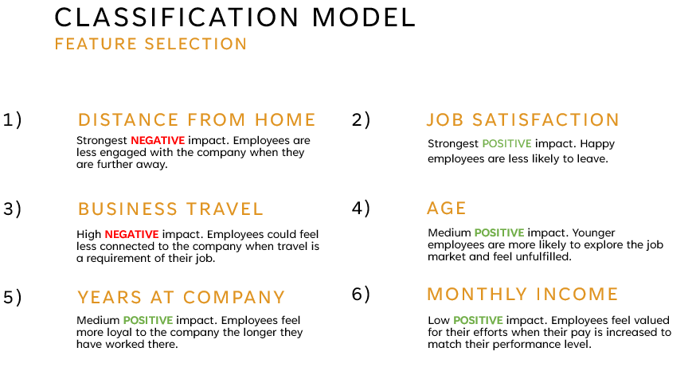
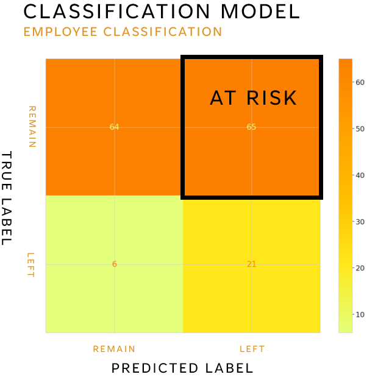
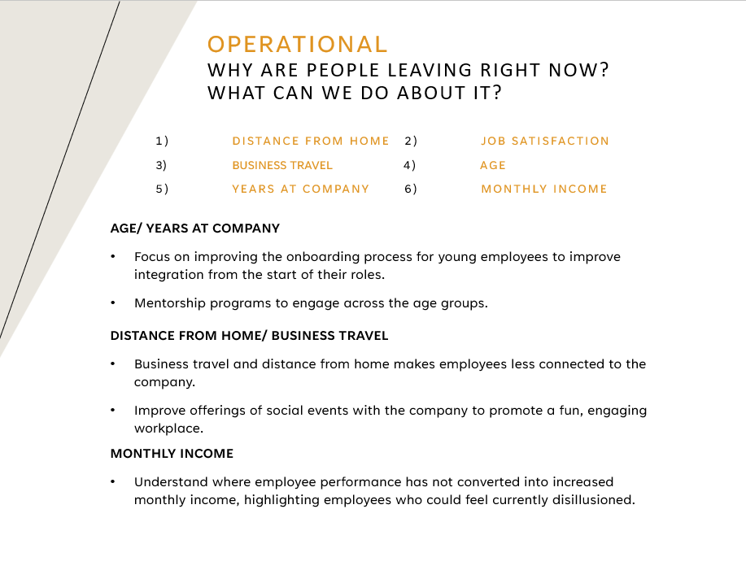
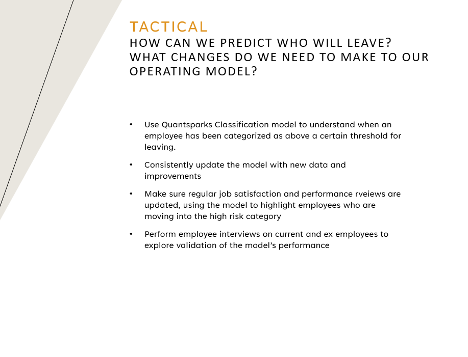
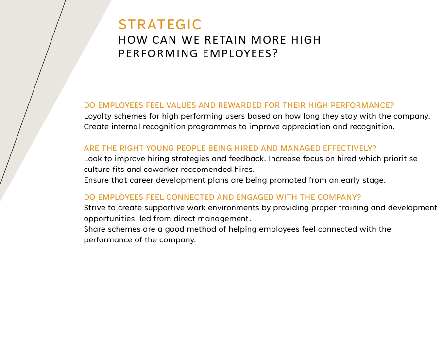

# Modelling and visualising high-performing employee churn. 

## Techniques used:
- Logistic Regression
- Data Analysis with Pandas
- Data Visualisation with Seaborn

## The objectives for this project are to improve:
- Retention of high performing employees
- Prediction of high performing employees at risk of leaving

## Analysis and Visualisations

Data was cleaned, preprocessed and analysed. Some high level visualisations were created to highlight some signifiant differences between high performing employees who left vs remain at the company. These have been designed to provide one clear message per slide/visualisation as it is being presented to C-level and is therefore business focused rather than technically in depth.

Visualisation 1            |  Visualisation 2          |  Visualisation 3                    
:-------------------------:|:-------------------------:|:-------------------------:
  |  |  

## Logistic Regression

The data was then modelled with a Logistic Regression to predict the likeihood of a high performing employees leaving. A Logistic Regression was chosen due to it's interpretability - with a linear model we are able to understand the relationship between the features and the classification. Recall is being prioritising as a metric due to the danger of miscategorising high-performing leavers as not-at-risk. Complementary to this is that the false positives of the classification can be highlighted as the at-risk users, ensuring they are focused on as part of an employee retention scheme. The probability threshold was chosen at 0.15 for this reason.

Feature Selection          |  Classification
:-------------------------:|:-------------------------:
  |  

## Objective Brief - Operational, Tactical and Strategic reccomendations

Business conclusions and objectives are now reccomended based on the data provided and the classification model's results. At this point a general discussion with the client based on their current objectives is also began, using the reccomendations as a starting point.

Operational            |  Tactical          |  Strategic                    
:-------------------------:|:-------------------------:|:-------------------------:
  |  |  
