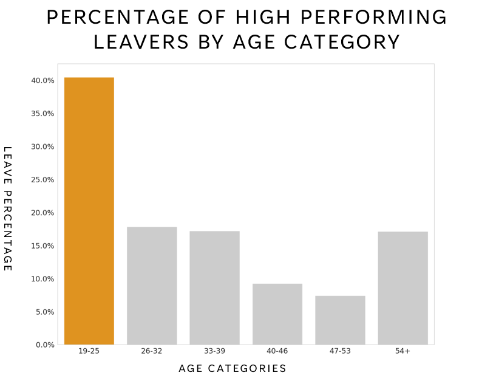
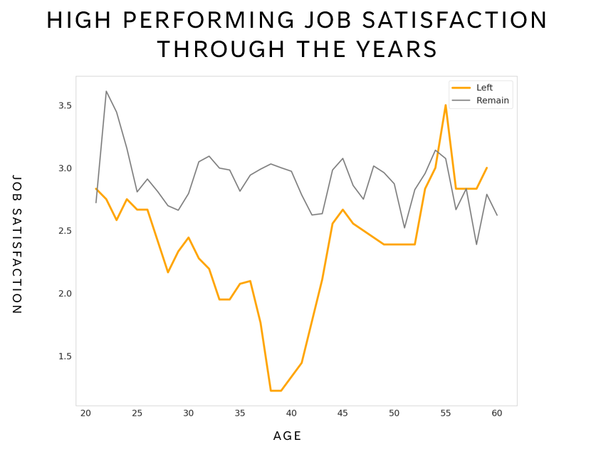
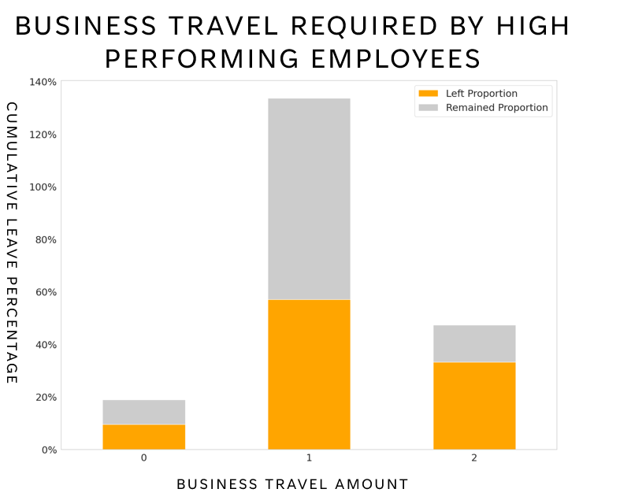

# employee_churn
Modelling and visualising high-performing employee churn. 

## Techniques used:
Logistic Regression
Data Visualisation
Pandas

The objectives for this project are to improve:
- Retention of high performing employees
- Prediction of high performing employees at risk of leaving

Data was cleaned, preprocessed and analysed. Some high level visualisations have ben created to highlight some signifiant differences between high performing employees who left vs remain at the company. These have been designed to provide one clear message per slide/visualisation as it is being presented to C-level and is therefore business focused rather than techniaclly in depth.

Solarized dark             |  Solarized Ocean           |  Solarized Ocean
:-------------------------:|:-------------------------:|:-------------------------:
  |  |  

# cryptobot
## Motivation for project:
#### Cryptocurrency markets are notoriously volatile, yet lucrative. Since the vast majority of cryptocurrencies are not based on any tangible assets, their value is strongly correlated to the way people feel about them. Therefore, finding a way to quantify this level of global feeling is an inherently powerful thing.
## Relationship between Bitcoin price and Twitter sentiment

##### MA sentiment is the moving average of sentiment over 7 days. This was used to reduce the effect of noise on the results so a pattern could be more clearly seen.
## Overview:
#### Cryptobot used a preexisting natural language processing (NLP) model to get a sentiment rating of Tweets, on a daily basis, over a 2.5 year period. This data showed that tweet sentiment does indeed have a bearing on the price of Bitcoin. A time series was generated, using our Tweet sentiment data and other key data. We were able to generate 2 day predications with a mean average percentage error (MAPE) of 4.5%. Volume of Bitcoin tweets was also examined and used as a measure of how significant the sentiment rating for a given day was. Data engineering was used to provide realtime updates on Streamlit.
### Project Architecture:

